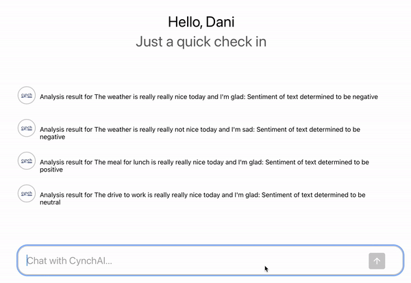

[![LinkedIn][linkedin-shield]][linkedin-url]
<a name="readme-top"></a>


<!-- PROJECT LOGO -->
<br />
<div align="center">
  <a href="https://github.com/CianDeely/TextAnalyzerAI">
    
  </a>

<h3 align="center">Text Sentiment Analyzer AI</h3>

  <p align="center">
    An interactive AI chatbot that allows users to enter in a sentence and the AI returns back the sentiment of the sentence
    <br />
  </p>
</div>


<!-- TABLE OF CONTENTS -->
<details>
  <summary>Table of Contents</summary>
  <ol>
    <li>
      <a href="#about-the-project">About The Project</a>
      <ul>
        <li><a href="#built-with">Built With</a></li>
      </ul>
    </li>
    <li>
      <a href="#getting-started">Getting Started</a>
      <ul>
        <li><a href="#prerequisites">Prerequisites</a></li>
        <li><a href="#installation">Installation</a></li>
      </ul>
    </li>
    <li><a href="#demo">Usage</a></li>
    <li><a href="#roadmap">Roadmap</a></li>
    <li><a href="#contact">Contact</a></li>
  </ol>
</details>


<!-- ABOUT THE PROJECT -->
## About The Project

[![Product Name Screen Shot][product-screenshot]](https://example.com)

This is a small React and Node AI chatbot application I built using Express/Node for the server/API and React.JS for the front end. It is a neat little implementation with some nice UI/UX tricks. 
It allows users to enter text into the chat bot and have the result be returned from the API and slowly type out to mimic an AI chat response
Users can set their user type from the chevron in the top left corner. The chevron direction changes based on whether the dropdown is open or closed.
Additionally a log tracks all requests made to the API and the responses.

Currently it is only returning mock responses from the AI. I will add logic to create genuine AI responses and brush up the front-end UI further as I develop more.
<p align="right">(<a href="#readme-top">back to top</a>)</p>


### Built With

* [![React][React.js]][React-url]
* [![Node][Node.js]][Node-url]
* [![JavaScript][JavaScript]][JavaScript-url]
* [![HTML5][HTML5]][HTML5-url]
* [![CSS3][CSS3]][CSS3-url]

<p align="right">(<a href="#readme-top">back to top</a>)</p>


<!-- GETTING STARTED -->
## Getting Started

To run this project on your local machine follow the steps outlined below:

### Prerequisites

This is an example of how to list things you need to use the software and how to install them.
* npm
  ```sh
  npm install npm@latest -g
  ```
* Visual Studio Code

### Installation

1. Clone the repo
   ```sh
   git clone https://github.com/ciandeely/TextAnalyzerAI
   ```
2. Open the TextAnalyzerAI folder in VS Code (or an equivalent IDE)
3. Install NPM packages
   ```sh
   npm install
   ```
4. Navigate to the front-end folder in your VS terminal
   ```sh
   cd front-end
   ```
5. Start the React project
   ```js
   npm start
   ```
6. In a separate terminal open the back-end folder by right clicking the folder and selecting "Open in Integrated Terminal"
7. Start the Node server in terminal
   ```sh
   node server.js
   ```
8. The React application will now open at http://localhost:3000 and run

<p align="right">(<a href="#readme-top">back to top</a>)</p>


<!-- DEMO VIDEO -->
## Demo Video

[](https://www.youtube.com/watch?v=wk98vNcyCMs)

<p align="right">(<a href="#readme-top">back to top</a>)</p>


<!-- ROADMAP -->
## Roadmap

- [ ] Implement actual sentiment analysis instead of mock response.
- [ ] Change the UI so the "Hey Dani" text slowly backspaces out and the AI response types out where it was.
- [ ] Change the chat format so it has the user's input with their PFP beside it and the AI response afterwards


<p align="right">(<a href="#readme-top">back to top</a>)</p>


<!-- CONTACT -->
## Contact

Cian Deely - [LinkedIn](https://www.linkedin.com/in/ciandeely) - ciandeely@outlook.com

Project Link: [https://github.com/ciandeely/TextAnalyzerAI](https://github.com/ciandeely/textanalyzerai)

<p align="right">(<a href="#readme-top">back to top</a>)</p>


<!-- MARKDOWN LINKS & IMAGES -->
[linkedin-shield]: https://img.shields.io/badge/-LinkedIn-black.svg?style=for-the-badge&logo=linkedin&colorB=555
[linkedin-url]: https://linkedin.com/in/ciandeely
[product-screenshot]: images/logo.jpeg
[React.js]: https://img.shields.io/badge/React-20232A?style=for-the-badge&logo=react&logoColor=61DAFB
[React-url]: https://reactjs.org/
[Node.js]:  https://img.shields.io/badge/Node.js-43853D?style=for-the-badge&logo=node.js&logoColor=white
[Node-url]: https://nodejs.org/en
[JavaScript]: https://img.shields.io/badge/JavaScript-F7DF1E?style=for-the-badge&logo=javascript&logoColor=black
[JavaScript-url]: https://www.javascript.com
[.Net]: https://img.shields.io/badge/.NET-5C2D91?style=for-the-badge&logo=.net&logoColor=white
[.Net-url]: https://dotnet.microsoft.com/en-us/
[HTML5]: https://img.shields.io/badge/HTML5-E34F26?style=for-the-badge&logo=html5&logoColor=white
[HTML5-url]: https://www.w3schools.com/html/
[CSS3]: https://img.shields.io/badge/CSS3-1572B6?style=for-the-badge&logo=css3&logoColor=white
[CSS3-url]: https://www.tutorialspoint.com/css/css3_tutorial.htm#:~:text=Cascading%20Style%20Sheets%20(CSS)%20is,Namespaces
