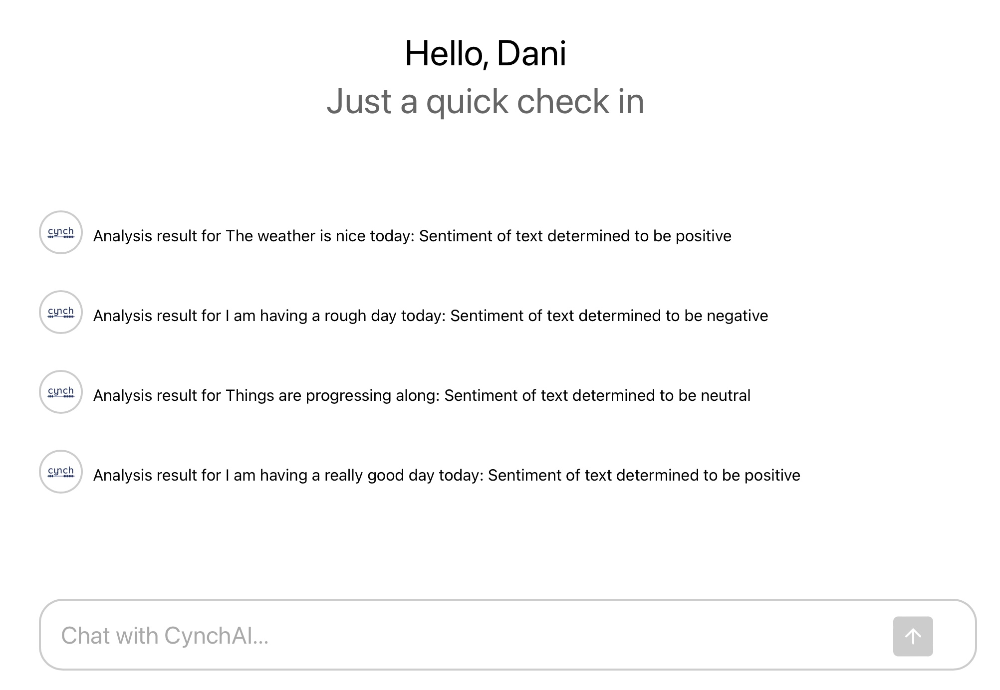

[![LinkedIn][linkedin-shield]][linkedin-url]
<a name="readme-top"></a>


<!-- PROJECT LOGO -->
<br />
<div align="center">
  <a href="https://github.com/CianDeely/Advanced-Task-Management-System">
    
  </a>

<h3 align="center">Text Sentiment Analyzer AI</h3>

  <p align="center">
    An interactive task management system that allows users to add, edit, and delete tasks
    <br />
  </p>
</div>


<!-- TABLE OF CONTENTS -->
<details>
  <summary>Table of Contents</summary>
  <ol>
    <li>
      <a href="#about-the-project">About The Project</a>
      <ul>
        <li><a href="#built-with">Built With</a></li>
      </ul>
    </li>
    <li>
      <a href="#getting-started">Getting Started</a>
      <ul>
        <li><a href="#prerequisites">Prerequisites</a></li>
        <li><a href="#installation">Installation</a></li>
      </ul>
    </li>
    <li><a href="#demo">Usage</a></li>
    <li><a href="#roadmap">Roadmap</a></li>
    <li><a href="#contact">Contact</a></li>
  </ol>
</details>


<!-- ABOUT THE PROJECT -->
## About The Project

[![Product Name Screen Shot][product-screenshot]](https://example.com)

This is a small task management system I built using ASP.Net for the server/API and React.JS for the front end. It is a neat little implementation with some nice advanced features. 
It allows users to create new tasks, update exisiting tasks and delete tasks entirely.
Users can set priorities and statuses for tasks. High priority tasks result in the API creating an event to log a .txt file with the details of the high priority file.
Additionally a log tracks all requests made to the API.

On the React.JS front end lazy loading is implemented so that tasks are only loaded dynamically as the user scrolls.
There is also a pie chart visualizing the split between task completion statuses.
When a user attempts to create a task of high priority or update an existing tasks priority to high a modal pops up to ask the user if they are sure
<p align="right">(<a href="#readme-top">back to top</a>)</p>


### Built With

* [![React][React.js]][React-url]
* [![Node][Node.js]][Node-url]
* [![.Net][.Net]][.Net-url]
* [![JavaScript][JavaScript]][JavaScript-url]
* [![HTML5][HTML5]][HTML5-url]
* [![CSS3][CSS3]][CSS3-url]

<p align="right">(<a href="#readme-top">back to top</a>)</p>


<!-- GETTING STARTED -->
## Getting Started

To run this project on your local machine follow the steps outlined below:

### Prerequisites

This is an example of how to list things you need to use the software and how to install them.
* npm
  ```sh
  npm install npm@latest -g
  ```
* Visual Studio 2022

* Visual Studio Code
* SQL Server

### Installation

1. Clone the repo
   ```sh
   git clone https://github.com/ciandeely/Advanced-Task-Management-System
   ```
2. Open the Advanced-Task-Managemnt-System-UI folder in VS Code (or an equivalent IDE)
3. Install NPM packages
   ```sh
   npm install
   ```
4. Start the React project
   ```js
   npm start
   ```
5. Open Advanced-Task-Management-System.sln in Visual Studio 2022 (or an equivalent IDE)
6. Build the project in VS2022
7. Start debugging the project
8. To create the database you can execute the "Create-DB.sql" script in SQL Server Management Studio
    ```js
   if db_id('tempdb') IS NULL
     CREATE DATABASE tempdb;
    
    GO

    CREATE TABLE tempdb.dbo.MyTasks (
        Id int NOT NULL IDENTITY(1, 1),
        Title varchar(50) NOT NULL,
        Description varchar(MAX),
        Priority int NOT NULL,
        Due_Date datetime NOT NULL,
        Status int NOT NULL,
        CONSTRAINT MyTasks_pk PRIMARY KEY (id)
    );
   ```
9. Navigate to appsettings.json within the VS2022 project and set your DefaultConnection string as appropriate. Mine is as follows
   ```sh
    "ConnectionStrings": {
    "DefaultConnection": "Server=localhost,1433;Database=tempdb;User Id=sa;password=Cytidel2024;Trusted_Connection=false;Encrypt=false;TrustServerCertificate=true;MultipleActiveResultSets=true;"
    },
    ```
10. You can now navigate to http://localhost:3000 and run the application

<p align="right">(<a href="#readme-top">back to top</a>)</p>


<!-- DEMO VIDEO -->
## Demo Video

[](https://www.youtube.com/watch?v=wk98vNcyCMs)

<p align="right">(<a href="#readme-top">back to top</a>)</p>


<!-- ROADMAP -->
## Roadmap

- [ ] Secure the API with JWT authentication and add a login feature in the React app.
- [ ] Implement unit tests for both backend and frontend.
- [ ] Add real-time capabilities: If a task is added or edited in one browser tab, it should
immediately reflect in another without a page refresh.

<p align="right">(<a href="#readme-top">back to top</a>)</p>


<!-- CONTACT -->
## Contact

Cian Deely - [LinkedIn](https://www.linkedin.com/in/ciandeely) - ciandeely@outlook.com

Project Link: [https://github.com/ciandeely/advanced-task-management-system](https://github.com/ciandeely/advanced-task-management-system)

<p align="right">(<a href="#readme-top">back to top</a>)</p>


<!-- MARKDOWN LINKS & IMAGES -->
[linkedin-shield]: https://img.shields.io/badge/-LinkedIn-black.svg?style=for-the-badge&logo=linkedin&colorB=555
[linkedin-url]: https://linkedin.com/in/ciandeely
[product-screenshot]: images/demo.gif
[React.js]: https://img.shields.io/badge/React-20232A?style=for-the-badge&logo=react&logoColor=61DAFB
[React-url]: https://reactjs.org/
[Node.js]:  https://img.shields.io/badge/Node.js-43853D?style=for-the-badge&logo=node.js&logoColor=white
[Node-url]: https://nodejs.org/en
[JavaScript]: https://img.shields.io/badge/JavaScript-F7DF1E?style=for-the-badge&logo=javascript&logoColor=black
[JavaScript-url]: https://www.javascript.com
[.Net]: https://img.shields.io/badge/.NET-5C2D91?style=for-the-badge&logo=.net&logoColor=white
[.Net-url]: https://dotnet.microsoft.com/en-us/
[HTML5]: https://img.shields.io/badge/HTML5-E34F26?style=for-the-badge&logo=html5&logoColor=white
[HTML5-url]: https://www.w3schools.com/html/
[CSS3]: https://img.shields.io/badge/CSS3-1572B6?style=for-the-badge&logo=css3&logoColor=white
[CSS3-url]: https://www.tutorialspoint.com/css/css3_tutorial.htm#:~:text=Cascading%20Style%20Sheets%20(CSS)%20is,Namespaces
